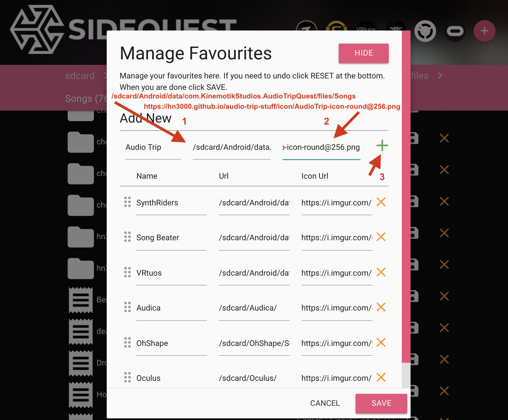

# An Audio Trip fan page

Just a place for some stuff I'd like to write down about the VR rhythm game
(https://audiotripvr.com)[Audio Trip]. It's about the only thing
I use my Oculus Quest for at the moment.

## Shortcut to Audio Trip Songs folder in SideQuest

Click the `+` to the right of the existing shortcuts.

Enter these values for the new shortcut:

* Audio Trip
* /sdcard/Android/data/com.KinemotikStudios.AudioTripQuest/files/Songs
* https://hn3000.github.io/audio-trip-stuff/icon/AT_Discord_Sidequest_folder.png

Then click the green '+' to add the entry.

Use the waffle icon on the left to move the entry to the desired position.

Voilà!

From the Audio Trip developers, specifically for use in SideQuest:

 
<https://hn3000.github.io/audio-trip-stuff/icon/AT_Discord_Sidequest_folder.png>

 
<https://hn3000.github.io/audio-trip-stuff/icon/AT_Discord_Sidequest_game.png>

 
<https://hn3000.github.io/audio-trip-stuff/icon/AT_Discord_Sidequest_music.png>

These are my old handmade icons, I will remove them soon:

 
<https://hn3000.github.io/audio-trip-stuff/icon/AudioTrip-icon-round@256.png>

<https://hn3000.github.io/audio-trip-stuff/icon/AudioTrip-icon-round2@256.png>

<https://hn3000.github.io/audio-trip-stuff/icon/AudioTrip-icon-round3@256.png>

 <https://hn3000.github.io/audio-trip-stuff/icon/AudioTrip-icon-round4@256.png>

------

Gladly hosted on github at <https://github.com/hn3000/audio-trip-stuff> , pull requests, issues or suggestions welcome!